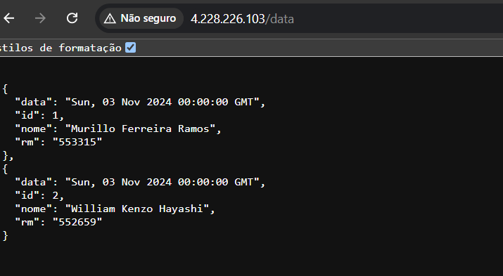

# Projeto DevOps Challenge - Odontoprev

Este projeto é parte do desafio DevOps e utiliza uma API desenvolvida em Python para manipulação de dados, utilizando Flask, MySQL, Docker e Nginx. O projeto foi configurado para deployment em uma máquina virtual no Azure com suporte a Docker Compose.

## Integrantes

- **Murillo Ferreira Ramos** - RM: 553315
- **Pedro Luiz Prado** - RM: 553874
- **William Kenzo Hayashi** - RM: 552659

## Índice

1. [Descrição do Projeto](#descrição-do-projeto)
2. [Tecnologias Utilizadas](#tecnologias-utilizadas)
3. [Como Acessar a API](#como-acessar-a-api-pela-url-do-seu-navegador)
4. [Estrutura de Pastas](#estrutura-de-pastas)
5. [Link do Vídeo](#links-importantes)


## Descrição do Projeto

Este projeto consiste em uma API REST que permite o gerenciamento de informações de usuários com dados como nome e RM. A aplicação utiliza Flask para o backend, MySQL como banco de dados, Docker para containerização e Nginx como proxy reverso.

## Tecnologias Utilizadas

- **Python** com Flask
- **MySQL** como banco de dados
- **Docker** e **Docker Compose**
- **Nginx** como proxy reverso
- **Microsoft Azure** para provisionamento da máquina virtual

## Como acessar a API pela URL do seu navegador
- Digite no navegador o seguinte: http://4.228.226.103/data
> ⚠️ **Alerta**: Existe a possibilidade da URL não ser encontrada devido à dependência dos créditos da Azure para manter a VM ativa.<br>


 ## Ela retornará a seguinte tela:

<br>No vídeo foi mostrado como fizemos a inserção de dados na API, incluimos o integrande Pedro Luiz


**Estrutura de Pastas**

```plaintext
.
├── app/
│   ├── app.py                # Código principal da API Flask
│   ├── init.sql              # Script SQL para inicialização do banco
│   ├── requirements.txt      # Dependências do Python
├── docker/
│   ├── Dockerfile            # Dockerfile para a API
│   ├── docker-compose.yml    # Configuração do Docker Compose
├── docs/
│   ├── README.md                 # Documentação do projeto
│   ├── evidencias/                 # Pasta com os prints
└── 
```

## Links Importantes:
https://www.youtube.com/watch?v=DpGH0B38R28
