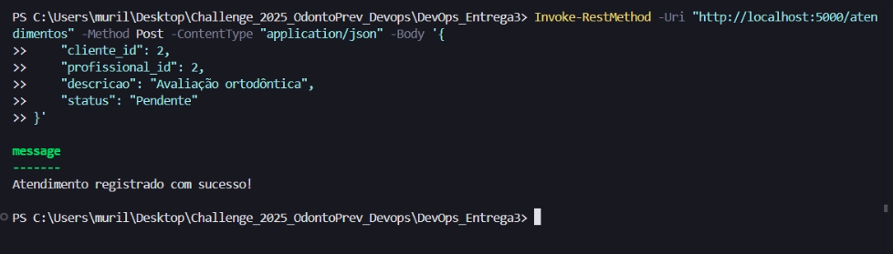

# Challenge DevOps - OdontoPrev

## Integrantes:

- **Murilo Ferreira Ramos** - RM553315
- **Pedro Luiz Prado** - RM553874
- **William Kenzo Hayashi** - RM552659


## Distribuição de Atividades

A divisão das atividades foi realizada conforme as disciplinas da grade curricular:

- **Murilo**: DevOps Tools, Cloud Computing, Compliance, Quality Assurance, e Tests.
- **Pedro**: Mobile Application Development, e Advanced Business Development With .NET.
- **William**: Java Advanced, Mastering Relational e Non-Relational Database, Disruptive Architectures IoT, IOB, Generative AI

## Cronograma de Tarefas

- [Link do Trello](https://trello.com/invite/b/6701a3ed3d57ce4ab46300fd/ATTIefc0215f428e24a577f7909e64cc600cF9FC88BA/backlog-challenge-odontoprev)

## Link do Vídeo de Apresentação

- [Link do Vídeo](https://youtu.be/HL41m0EBVng)

## Documentação Completa

A documentação técnica detalhada do projeto, incluindo descrição da arquitetura, banco de dados, fluxos de requisição e melhorias, está disponível na pasta [`docs`](docs/). 

## Desenho de Arquitetura


## Rodagem da Aplicação

Para executar a API, siga os passos abaixo:

1. **Derrubar os containers ativos:**
   ```powershell
   docker-compose down
   ```
   

2. **Construir as imagens sem cache:**
   ```powershell
   docker-compose build --no-cache
   ```
   

3. **Subir os containers:**
   ```powershell
   docker-compose up -d
   ```
   

4. **Verificar se os containers estão rodando:**
   ```powershell
   docker ps
   ```
   

5. **Testar a API:**
   ```powershell
   Invoke-RestMethod -Uri http://localhost:5000/clientes -Method Get
   ```
   
   

## Listagem de Endpoints

### Criar Cliente

- **Método**: POST
- **URL**: `http://localhost:5000/clientes`
- **Body**:
  ```json
  {
    "nome": "João da Silva",
    "email": "joao.silva@email.com",
    "cpf": "123.456.789-00",
    "telefone": "(11) 91234-5678"
  }
  ```
- **Print:** 

### Criar Profissional

- **Método**: POST
- **URL**: `http://localhost:5000/profissionais`
- **Body**:
  ```json
  {
    "nome": "Dr. Maria Oliveira",
    "email": "maria.oliveira@email.com",
    "cpf": "987.654.321-00",
    "cro": "12345",
    "especialidade": "Odontologia",
    "telefone": "(11) 99876-5432"
  }
  ```
- **Print:** 

### Criar Atendimento

- **Método**: POST
- **URL**: `http://localhost:5000/atendimentos`
- **Body**:
  ```json
  {
    "cliente_id": 1,
    "profissional_id": 1,
    "descricao": "Consulta odontológica de rotina",
    "status": "Pendente"
  }
  ```
- **Print:** 

### Criar Pagamento

- **Método**: POST
- **URL**: `http://localhost:5000/pagamentos`
- **Body**:
  ```json
  {
    "atendimento_id": 1,
    "valor": 150.00,
    "metodo_pagamento": "Cartão de crédito",
    "status": "Pendente"
  }
  ```
- **Print:** 

### Criar Sinistro

- **Método**: POST
- **URL**: `http://localhost:5000/sinistros`
- **Body**:
  ```json
  {
    "atendimento_id": 1,
    "tipo_sinistro": "Quebra de dente",
    "descricao": "Quebra de dente durante a consulta",
    "status": "Em análise"
  }
  ```
- **Print:** 

### Listar Clientes

- **Método**: GET
- **URL**: `http://localhost:5000/clientes`
- **Print:** 

### Listar Profissionais

- **Método**: GET
- **URL**: `http://localhost:5000/profissionais`
- **Print:** 

### Listar Atendimentos

- **Método**: GET
- **URL**: `http://localhost:5000/atendimentos`
- **Print:** 

### Listar Pagamentos

- **Método**: GET
- **URL**: `http://localhost:5000/pagamentos`
- **Print:** 

### Listar Sinistros

- **Método**: GET
- **URL**: `http://localhost:5000/sinistros`
- **Print:** 

---

Este projeto foi desenvolvido como parte do **Challenge de DevOps Tools e Cloud Computing**, focando na implementação e automação de uma API REST conectada a um banco de dados SQL Server.
